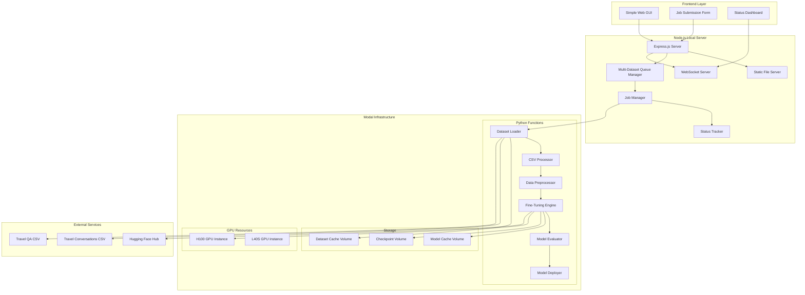
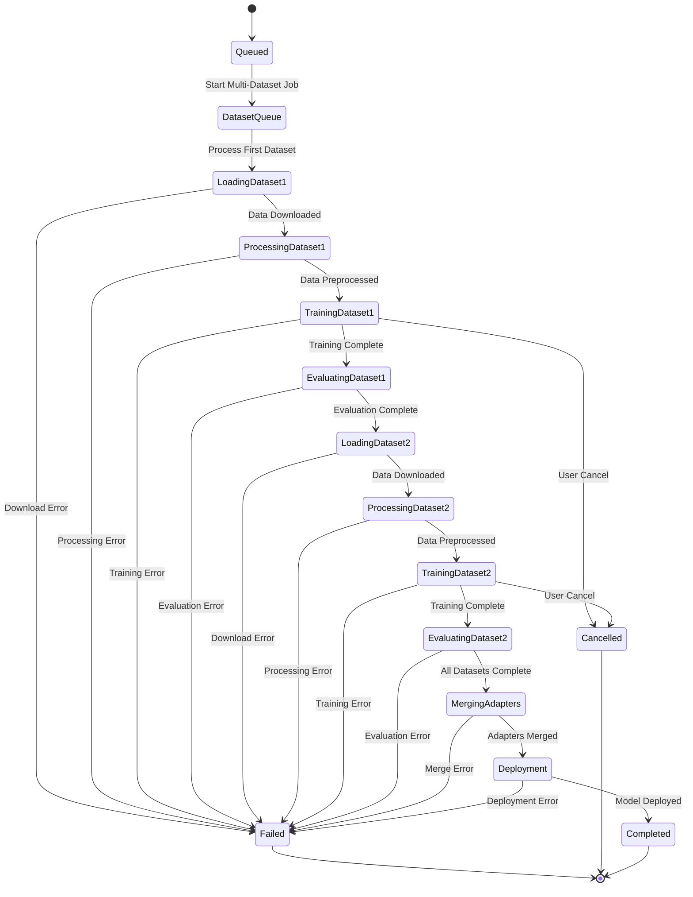

# GPT-OSS 20B Fine-Tuning with Node.js Orchestration on Modal

## Overview

This document outlines the architecture and implementation plan for fine-tuning the GPT-OSS 20B model using the Reddit Travel QA dataset, orchestrated through a Node.js application running on Modal infrastructure. The solution combines Modal's GPU-accelerated Python functions for the actual fine-tuning process with Node.js web services for orchestration, monitoring, and API endpoints.

**Key Components:**
- GPT-OSS 20B model (4-bit quantized MoE architecture)
- Travel Conversations Dataset (680MB CSV) and Travel QA Dataset (147MB CSV)
- Sequential queue system for multi-dataset processing
- Node.js orchestration layer
- Modal serverless GPU infrastructure
- LoRA (Low-Rank Adaptation) fine-tuning approach

## Technology Stack & Dependencies

### Core Infrastructure
- **Modal**: Serverless GPU platform for ML workloads
- **Node.js**: Orchestration and API layer
- **Python**: Fine-tuning execution environment
- **Docker**: Container image management

### ML/AI Stack
- **PyTorch**: Deep learning framework
- **Transformers**: Hugging Face model library
- **PEFT**: Parameter Efficient Fine-Tuning
- **vLLM**: High-performance inference engine
- **Unsloth**: Optimized fine-tuning library (2x faster, 70% less memory)

### Node.js Dependencies
```json
{
  "express": "^4.18.0",
  "axios": "^1.6.0",
  "ws": "^8.14.0",
  "dotenv": "^16.0.0",
  "winston": "^3.10.0",
  "cors": "^2.8.5"
}
```

## Architecture

### System Architecture Diagram



### Component Definitions

#### Node.js Orchestration Layer

**Express.js Server**
- RESTful API endpoints for job submission and monitoring
- Static file serving for frontend GUI
- CORS enabled for local development
- Request validation and error handling

**Job Manager**
- Sequential queue management for multi-dataset fine-tuning
- Modal function invocation and monitoring
- Resource allocation and scaling decisions
- Job lifecycle management with dataset progression tracking

**Multi-Dataset Queue Manager**
- Manages sequential processing of multiple datasets
- Automatic dataset switching upon completion
- Progress tracking across all queued datasets
- Failure handling and retry logic per dataset

**Status Tracker**
- Real-time job status monitoring
- Progress reporting and metrics collection
- Error logging and notification system
- Performance analytics dashboard

**WebSocket Server**
- Real-time updates to connected clients
- Progress streaming during training
- Live metrics broadcasting
- Interactive job control interface

#### Modal Python Functions

**Dataset Loader Function**
- Automatically downloads Travel Conversations and Travel QA datasets from HuggingFace
- Handles large CSV file processing with LFS support
- Dataset validation and integrity checks
- Conversion to HuggingFace dataset format
- Sequential dataset queuing and management

**CSV Processor Function**
- Parses large CSV files (680MB + 147MB)
- Handles conversation format extraction
- Topic-based filtering and categorization
- Memory-efficient streaming processing
- Data quality validation and cleaning

**Data Preprocessor Function**
- Text cleaning and normalization
- Chat template formatting
- Train/validation split generation
- Token length optimization

**Fine-Tuning Engine Function**
- GPT-OSS 20B model loading with 4-bit quantization
- LoRA adapter configuration and training
- Gradient checkpointing for memory optimization
- Training loop with monitoring hooks

**Model Evaluator Function**
- Validation metrics computation
- Sample generation and quality assessment
- Performance benchmarking
- Model comparison analytics

**Model Deployer Function**
- LoRA adapter merging and export
- Model packaging for inference
- Deployment to inference endpoints
- Version management and rollback

## API Endpoints Reference

### Fine-Tuning Job Management

#### POST /api/jobs/finetune
**Description:** Submit a new multi-dataset fine-tuning job
**Request Schema:**
```json
{
  "model_name": "openai/gpt-oss-20b",
  "datasets_config": [
    {
      "source": "huggingface",
      "name": "soniawmeyer/travel-conversations-finetuning",
      "file": "conversational_sample_processed_with_topic.csv",
      "format": "csv",
      "train_split": 0.9,
      "priority": 1,
      "description": "Travel Conversations Dataset (680MB)"
    },
    {
      "source": "huggingface", 
      "name": "soniawmeyer/travel-conversations-finetuning",
      "file": "travel_QA_processed_with_topic.csv",
      "format": "csv",
      "train_split": 0.9,
      "priority": 2,
      "description": "Travel QA Dataset (147MB)"
    }
  ],
  "training_config": {
    "max_steps_per_dataset": 1000,
    "learning_rate": 2e-4,
    "batch_size": 4,
    "gradient_accumulation_steps": 8,
    "lora_rank": 16,
    "lora_alpha": 32,
    "warmup_steps": 100,
    "save_checkpoint_between_datasets": true
  },
  "gpu_config": {
    "type": "H100",
    "count": 1,
    "timeout_hours": 12
  },
  "queue_config": {
    "process_sequentially": true,
    "continue_on_failure": false,
    "merge_adapters": true
  }
}
```

**Response Schema:**
```json
{
  "job_id": "ft_job_abc123",
  "status": "queued",
  "estimated_duration": "4-8 hours",
  "total_datasets": 2,
  "datasets_queue": [
    {
      "dataset_id": "conv_dataset",
      "description": "Travel Conversations Dataset (680MB)",
      "status": "queued",
      "priority": 1
    },
    {
      "dataset_id": "qa_dataset",
      "description": "Travel QA Dataset (147MB)", 
      "status": "queued",
      "priority": 2
    }
  ],
  "created_at": "2024-01-15T10:30:00Z"
}
```

#### GET /api/jobs/{job_id}
**Description:** Get job status and details with multi-dataset progress
**Response Schema:**
```json
{
  "job_id": "ft_job_abc123",
  "status": "training",
  "current_dataset": {
    "dataset_id": "conv_dataset",
    "description": "Travel Conversations Dataset (680MB)",
    "dataset_index": 1,
    "total_datasets": 2
  },
  "overall_progress": {
    "datasets_completed": 0,
    "total_datasets": 2,
    "overall_percentage": 22.5,
    "elapsed_time": "1h 23m",
    "eta": "4h 15m"
  },
  "current_dataset_progress": {
    "current_step": 450,
    "total_steps": 1000,
    "progress_percentage": 45,
    "dataset_eta": "1h 52m"
  },
  "metrics": {
    "train_loss": 0.234,
    "eval_loss": 0.289,
    "learning_rate": 0.00018,
    "gpu_utilization": 89
  },
  "datasets_status": [
    {
      "dataset_id": "conv_dataset",
      "status": "training",
      "progress": 45,
      "final_metrics": null
    },
    {
      "dataset_id": "qa_dataset",
      "status": "queued",
      "progress": 0,
      "final_metrics": null
    }
  ],
  "logs_url": "/api/jobs/ft_job_abc123/logs"
}
```

#### DELETE /api/jobs/{job_id}
**Description:** Cancel a running job

### Model Management

#### GET /api/models
**Description:** List available fine-tuned models
**Response Schema:**
```json
{
  "models": [
    {
      "model_id": "gpt-oss-20b-reddit-travel-v1",
      "base_model": "openai/gpt-oss-20b",
      "dataset": "reddit-travel-qa",
      "created_at": "2024-01-15T14:30:00Z",
      "metrics": {
        "final_train_loss": 0.198,
        "final_eval_loss": 0.245,
        "perplexity": 12.3
      },
      "deployment_status": "deployed"
    }
  ]
}
```

#### POST /api/models/{model_id}/deploy
**Description:** Deploy fine-tuned model to inference endpoint
**Request Schema:**
```json
{
  "endpoint_config": {
    "gpu_type": "L40S",
    "max_concurrent_requests": 10,
    "auto_scale": true
  }
}
```

### Real-time Monitoring

#### WebSocket: /ws/jobs/{job_id}
**Events:**
- `training_progress`: Step-by-step training updates
- `metrics_update`: Loss, learning rate, GPU utilization
- `log_message`: Training logs and debug information
- `status_change`: Job status transitions
- `error_occurred`: Error messages and stack traces

## Frontend GUI Design

### Web Interface Architecture

**Simple Single Page Application**
- Vanilla HTML/CSS/JavaScript (no framework overhead)
- Real-time updates via WebSocket connection
- Responsive design for desktop and mobile
- Clean, intuitive interface for non-technical users

### Frontend File Structure
```
public/
├── index.html              # Main application page
├── css/
│   ├── styles.css         # Main stylesheet
│   └── dashboard.css      # Dashboard-specific styles
├── js/
│   ├── app.js            # Main application logic
│   ├── websocket.js      # WebSocket connection handler
│   ├── forms.js          # Form validation and submission
│   └── dashboard.js      # Real-time dashboard updates
└── assets/
    ├── logo.png
    └── icons/
```

### Main Interface Components

#### Job Submission Form
```html
<div class="job-form-container">
  <h2>Start Fine-Tuning Job</h2>
  <form id="finetune-form">
    <!-- Model Configuration -->
    <div class="form-section">
      <h3>Model Configuration</h3>
      <label>Model Name:</label>
      <select name="model_name">
        <option value="openai/gpt-oss-20b">GPT-OSS 20B (Recommended)</option>
      </select>
      
      <label>Max Sequence Length:</label>
      <input type="number" name="max_seq_length" value="2048" min="512" max="4096">
    </div>

    <!-- Dataset Configuration -->
    <div class="form-section">
      <h3>Dataset Configuration</h3>
      <div class="datasets-info">
        <h4>Datasets to be processed sequentially:</h4>
        <div class="dataset-item">
          <span class="dataset-priority">1.</span>
          <div class="dataset-details">
            <strong>Travel Conversations Dataset</strong>
            <br><small>680MB CSV - Conversational travel data with topics</small>
          </div>
        </div>
        <div class="dataset-item">
          <span class="dataset-priority">2.</span>
          <div class="dataset-details">
            <strong>Travel QA Dataset</strong>
            <br><small>147MB CSV - Question-answer pairs for travel topics</small>
          </div>
        </div>
      </div>
      
      <label>Steps per Dataset:</label>
      <input type="number" name="max_steps" value="1000" min="10" max="5000">
      
      <label>
        <input type="checkbox" name="continue_on_failure" checked>
        Continue processing next dataset if one fails
      </label>
      
      <label>
        <input type="checkbox" name="merge_adapters" checked>
        Merge LoRA adapters from all datasets
      </label>
    </div>
    <!-- Training Parameters -->
    <div class="form-section">
      <h3>Training Parameters</h3>
      <label>Learning Rate:</label>
      <input type="number" name="learning_rate" value="0.0002" step="0.0001" min="0.00001">
      
      <label>Batch Size:</label>
      <select name="batch_size">
        <option value="1">1 (Memory Safe)</option>
        <option value="2">2</option>
        <option value="4" selected>4 (Recommended)</option>
        <option value="8">8 (High Memory)</option>
      </select>
    </div>

    <!-- LoRA Configuration -->
    <div class="form-section">
      <h3>LoRA Configuration</h3>
      <label>LoRA Rank:</label>
      <select name="lora_rank">
        <option value="8">8 (Fast)</option>
        <option value="16" selected>16 (Balanced)</option>
        <option value="32">32 (High Quality)</option>
        <option value="64">64 (Maximum)</option>
      </select>
      
      <label>LoRA Alpha:</label>
      <input type="number" name="lora_alpha" value="32" min="8" max="128">
    </div>

    <!-- GPU Configuration -->
    <div class="form-section">
      <h3>GPU Configuration</h3>
      <label>GPU Type:</label>
      <select name="gpu_type">
        <option value="L40S">L40S (Cost Effective)</option>
        <option value="H100" selected>H100 (High Performance)</option>
      </select>
      
      <label>Timeout (hours):</label>
      <input type="number" name="timeout_hours" value="12" min="2" max="24">
    </div>

    <button type="submit" class="submit-btn">Start Multi-Dataset Fine-Tuning</button>
  </form>
</div>
```

#### Real-time Dashboard
```html
<div class="dashboard-container">
  <h2>Training Dashboard</h2>
  
  <!-- Job Status Overview -->
  <div class="status-overview">
    <div class="status-card" id="job-status">
      <h3>Overall Job Status</h3>
      <span class="status-badge">Queued</span>
    </div>
    
    <div class="status-card" id="dataset-progress">
      <h3>Dataset Progress</h3>
      <div class="dataset-status">
        <span class="current-dataset">Waiting to start...</span>
        <span class="dataset-counter">0 / 2 datasets</span>
      </div>
    </div>
    
    <div class="status-card" id="overall-progress">
      <h3>Overall Progress</h3>
      <div class="progress-bar">
        <div class="progress-fill" style="width: 0%"></div>
      </div>
      <span class="progress-text">0% complete</span>
    </div>
    
    <div class="status-card" id="eta-card">
      <h3>ETA</h3>
      <span class="eta-text">Calculating...</span>
    </div>
  </div>

  <!-- Current Dataset Progress -->
  <div class="current-dataset-section">
    <h3>Current Dataset Progress</h3>
    <div class="dataset-info-bar">
      <span class="dataset-name">--</span>
      <span class="dataset-size">--</span>
    </div>
    <div class="progress-bar dataset-progress-bar">
      <div class="progress-fill" style="width: 0%"></div>
    </div>
    <span class="dataset-progress-text">0 / 0 steps</span>
  </div>

  <!-- Training Metrics -->
  <div class="metrics-container">
    <div class="metric-card">
      <h4>Training Loss</h4>
      <div class="metric-value" id="train-loss">--</div>
    </div>
    
    <div class="metric-card">
      <h4>Validation Loss</h4>
      <div class="metric-value" id="val-loss">--</div>
    </div>
    
    <div class="metric-card">
      <h4>Learning Rate</h4>
      <div class="metric-value" id="learning-rate">--</div>
    </div>
    
    <div class="metric-card">
      <h4>GPU Utilization</h4>
      <div class="metric-value" id="gpu-util">--</div>
    </div>
  </div>

  <!-- Live Logs -->
  <div class="logs-container">
    <h3>Live Training Logs</h3>
    <div class="logs-output" id="training-logs"></div>
  </div>

  <!-- Job Controls -->
  <div class="job-controls">
    <button id="cancel-job" class="cancel-btn" disabled>Cancel Job</button>
    <button id="download-logs" class="download-btn">Download Logs</button>
  </div>
</div>
```

#### Model Management Interface
```html
<div class="models-container">
  <h2>Fine-tuned Models</h2>
  
  <div class="models-grid" id="models-list">
    <!-- Dynamically populated with model cards -->
  </div>
  
  <template id="model-card-template">
    <div class="model-card">
      <h3 class="model-name"></h3>
      <div class="model-info">
        <span class="model-date"></span>
        <span class="model-status"></span>
      </div>
      <div class="model-metrics">
        <div class="metric">
          <span class="metric-label">Final Loss:</span>
          <span class="metric-value final-loss"></span>
        </div>
        <div class="metric">
          <span class="metric-label">Perplexity:</span>
          <span class="metric-value perplexity"></span>
        </div>
      </div>
      <div class="model-actions">
        <button class="deploy-btn">Deploy</button>
        <button class="test-btn">Test</button>
        <button class="delete-btn">Delete</button>
      </div>
    </div>
  </template>
</div>
```

### Frontend JavaScript Architecture

#### WebSocket Connection Manager
```javascript
class WebSocketManager {
  constructor() {
    this.ws = null;
    this.reconnectAttempts = 0;
    this.maxReconnectAttempts = 5;
  }

  connect(jobId) {
    const wsUrl = `ws://localhost:3000/ws/jobs/${jobId}`;
    this.ws = new WebSocket(wsUrl);
    
    this.ws.onopen = () => {
      console.log('WebSocket connected');
      this.reconnectAttempts = 0;
    };

    this.ws.onmessage = (event) => {
      const data = JSON.parse(event.data);
      this.handleMessage(data);
    };

    this.ws.onclose = () => {
      this.handleReconnect();
    };

    this.ws.onerror = (error) => {
      console.error('WebSocket error:', error);
    };
  }

  handleMessage(data) {
    switch(data.type) {
      case 'training_progress':
        updateProgress(data.payload);
        break;
      case 'metrics_update':
        updateMetrics(data.payload);
        break;
      case 'log_message':
        appendLog(data.payload);
        break;
      case 'status_change':
        updateStatus(data.payload);
        break;
      case 'error_occurred':
        showError(data.payload);
        break;
    }
  }

  handleReconnect() {
    if (this.reconnectAttempts < this.maxReconnectAttempts) {
      setTimeout(() => {
        this.reconnectAttempts++;
        this.connect(currentJobId);
      }, 2000 * this.reconnectAttempts);
    }
  }
}
```

#### Form Submission Handler
```javascript
class FormHandler {
  constructor() {
    this.form = document.getElementById('finetune-form');
    this.attachEventListeners();
  }

  attachEventListeners() {
    this.form.addEventListener('submit', this.handleSubmit.bind(this));
    
    // Real-time validation
    const inputs = this.form.querySelectorAll('input, select');
    inputs.forEach(input => {
      input.addEventListener('change', this.validateField.bind(this));
    });
  }

  async handleSubmit(event) {
    event.preventDefault();
    
    if (!this.validateForm()) {
      return;
    }

    const formData = new FormData(this.form);
    const config = this.buildConfig(formData);
    
    try {
      showLoading(true);
      const response = await fetch('/api/jobs/finetune', {
        method: 'POST',
        headers: {
          'Content-Type': 'application/json'
        },
        body: JSON.stringify(config)
      });

      const result = await response.json();
      
      if (response.ok) {
        showSuccess(`Job started: ${result.job_id}`);
        switchToDashboard(result.job_id);
      } else {
        showError(result.error || 'Failed to start job');
      }
    } catch (error) {
      showError('Network error: ' + error.message);
    } finally {
      showLoading(false);
    }
  }

  buildConfig(formData) {
    return {
      model_name: formData.get('model_name'),
      datasets_config: [
        {
          source: 'huggingface',
          name: 'soniawmeyer/travel-conversations-finetuning',
          file: 'conversational_sample_processed_with_topic.csv',
          format: 'csv',
          train_split: 0.9,
          priority: 1,
          description: 'Travel Conversations Dataset (680MB)'
        },
        {
          source: 'huggingface', 
          name: 'soniawmeyer/travel-conversations-finetuning',
          file: 'travel_QA_processed_with_topic.csv',
          format: 'csv',
          train_split: 0.9,
          priority: 2,
          description: 'Travel QA Dataset (147MB)'
        }
      ],
      training_config: {
        max_steps_per_dataset: parseInt(formData.get('max_steps')),
        learning_rate: parseFloat(formData.get('learning_rate')),
        batch_size: parseInt(formData.get('batch_size')),
        gradient_accumulation_steps: 8,
        lora_rank: parseInt(formData.get('lora_rank')),
        lora_alpha: parseInt(formData.get('lora_alpha')),
        warmup_steps: Math.floor(parseInt(formData.get('max_steps')) * 0.1),
        save_checkpoint_between_datasets: true
      },
      gpu_config: {
        type: formData.get('gpu_type'),
        count: 1,
        timeout_hours: parseInt(formData.get('timeout_hours'))
      },
      queue_config: {
        process_sequentially: true,
        continue_on_failure: false,
        merge_adapters: true
      }
    };
  }

  validateForm() {
    // Implement validation logic
    const maxSteps = parseInt(this.form.max_steps.value);
    if (maxSteps < 10 || maxSteps > 10000) {
      showError('Max steps must be between 10 and 10000');
      return false;
    }
    
    const learningRate = parseFloat(this.form.learning_rate.value);
    if (learningRate < 0.00001 || learningRate > 0.01) {
      showError('Learning rate must be between 0.00001 and 0.01');
      return false;
    }
    
    return true;
  }
}
```

#### Dashboard Update Functions
```javascript
function updateProgress(progress) {
  // Update overall progress
  const overallProgressBar = document.querySelector('#overall-progress .progress-fill');
  const overallProgressText = document.querySelector('#overall-progress .progress-text');
  
  if (progress.overall_percentage !== undefined) {
    overallProgressBar.style.width = `${progress.overall_percentage}%`;
    overallProgressText.textContent = `${progress.overall_percentage.toFixed(1)}% complete`;
  }
  
  // Update dataset progress
  const datasetProgressBar = document.querySelector('.dataset-progress-bar .progress-fill');
  const datasetProgressText = document.querySelector('.dataset-progress-text');
  
  if (progress.current_dataset_progress) {
    const datasetPercentage = (progress.current_dataset_progress.current_step / progress.current_dataset_progress.total_steps) * 100;
    datasetProgressBar.style.width = `${datasetPercentage}%`;
    datasetProgressText.textContent = `${progress.current_dataset_progress.current_step} / ${progress.current_dataset_progress.total_steps} steps`;
  }
  
  // Update dataset counter
  if (progress.overall_progress) {
    const datasetCounter = document.querySelector('.dataset-counter');
    datasetCounter.textContent = `${progress.overall_progress.datasets_completed} / ${progress.overall_progress.total_datasets} datasets`;
  }
  
  // Update current dataset info
  if (progress.current_dataset) {
    document.querySelector('.dataset-name').textContent = progress.current_dataset.description;
    document.querySelector('.dataset-size').textContent = `Dataset ${progress.current_dataset.dataset_index}/${progress.current_dataset.total_datasets}`;
    document.querySelector('.current-dataset').textContent = `Processing: ${progress.current_dataset.description}`;
  }
  
  if (progress.overall_progress && progress.overall_progress.eta) {
    document.querySelector('.eta-text').textContent = progress.overall_progress.eta;
  }
}

function updateMetrics(metrics) {
  if (metrics.train_loss !== undefined) {
    document.getElementById('train-loss').textContent = metrics.train_loss.toFixed(4);
  }
  
  if (metrics.eval_loss !== undefined) {
    document.getElementById('val-loss').textContent = metrics.eval_loss.toFixed(4);
  }
  
  if (metrics.learning_rate !== undefined) {
    document.getElementById('learning-rate').textContent = metrics.learning_rate.toExponential(2);
  }
  
  if (metrics.gpu_utilization !== undefined) {
    document.getElementById('gpu-util').textContent = `${metrics.gpu_utilization}%`;
  }
}

function appendLog(logData) {
  const logsContainer = document.getElementById('training-logs');
  const logEntry = document.createElement('div');
  logEntry.className = `log-entry log-${logData.level || 'info'}`;
  
  // Add dataset prefix to logs
  const timestamp = new Date().toLocaleTimeString();
  const datasetPrefix = logData.dataset_id ? `[${logData.dataset_id}] ` : '';
  logEntry.textContent = `[${timestamp}] ${datasetPrefix}${logData.message}`;
  
  logsContainer.appendChild(logEntry);
  logsContainer.scrollTop = logsContainer.scrollHeight;
  
  // Limit log entries to prevent memory issues
  const maxLogs = 1000;
  while (logsContainer.children.length > maxLogs) {
    logsContainer.removeChild(logsContainer.firstChild);
  }
}

function updateStatus(status) {
  const statusBadge = document.querySelector('.status-badge');
  statusBadge.textContent = status.status;
  statusBadge.className = `status-badge status-${status.status.toLowerCase()}`;
  
  // Update dataset-specific status indicators
  if (status.datasets_status) {
    updateDatasetStatusIndicators(status.datasets_status);
  }
  
  // Enable/disable controls based on status
  const cancelBtn = document.getElementById('cancel-job');
  cancelBtn.disabled = !['queued', 'running', 'training'].includes(status.status);
}

function updateDatasetStatusIndicators(datasetsStatus) {
  // Create or update dataset status indicators in the UI
  const statusContainer = document.querySelector('.datasets-info') || createDatasetStatusContainer();
  
  datasetsStatus.forEach((dataset, index) => {
    const indicator = statusContainer.querySelector(`[data-dataset-id="${dataset.dataset_id}"]`);
    if (indicator) {
      const statusClass = `dataset-status-${dataset.status}`;
      indicator.className = `dataset-indicator ${statusClass}`;
      indicator.querySelector('.dataset-progress-mini').style.width = `${dataset.progress}%`;
    }
  });
}
```

### CSS Styling Framework

#### Main Stylesheet Structure
```css
/* Reset and Base Styles */
* {
  margin: 0;
  padding: 0;
  box-sizing: border-box;
}

body {
  font-family: 'Segoe UI', Tahoma, Geneva, Verdana, sans-serif;
  background: linear-gradient(135deg, #667eea 0%, #764ba2 100%);
  min-height: 100vh;
  color: #333;
}

/* Layout Components */
.container {
  max-width: 1200px;
  margin: 0 auto;
  padding: 20px;
}

.form-section {
  background: white;
  border-radius: 8px;
  padding: 24px;
  margin-bottom: 20px;
  box-shadow: 0 2px 10px rgba(0,0,0,0.1);
}

/* Form Styling */
.form-section h3 {
  color: #4a5568;
  margin-bottom: 16px;
  border-bottom: 2px solid #e2e8f0;
  padding-bottom: 8px;
}

input, select {
  width: 100%;
  padding: 12px;
  border: 2px solid #e2e8f0;
  border-radius: 6px;
  font-size: 14px;
  margin-bottom: 12px;
  transition: border-color 0.2s;
}

input:focus, select:focus {
  outline: none;
  border-color: #667eea;
}

/* Button Styles */
.submit-btn {
  background: linear-gradient(135deg, #667eea 0%, #764ba2 100%);
  color: white;
  border: none;
  padding: 15px 30px;
  border-radius: 6px;
  font-size: 16px;
  font-weight: 600;
  cursor: pointer;
  transition: transform 0.2s;
}

.submit-btn:hover {
  transform: translateY(-2px);
}

/* Dashboard Styling */
.status-overview {
  display: grid;
  grid-template-columns: repeat(auto-fit, minmax(250px, 1fr));
  gap: 20px;
  margin-bottom: 30px;
}

.status-card {
  background: white;
  padding: 24px;
  border-radius: 8px;
  box-shadow: 0 2px 10px rgba(0,0,0,0.1);
  text-align: center;
}

.progress-bar {
  width: 100%;
  height: 8px;
  background: #e2e8f0;
  border-radius: 4px;
  margin: 12px 0;
  overflow: hidden;
}

.progress-fill {
  height: 100%;
  background: linear-gradient(90deg, #48bb78, #38a169);
  transition: width 0.3s ease;
}

/* Status Badge Colors */
.status-queued { background: #ffd700; color: #333; }
.status-running { background: #4299e1; color: white; }
.status-training { background: #48bb78; color: white; }
.status-completed { background: #38a169; color: white; }
.status-failed { background: #f56565; color: white; }
.status-cancelled { background: #a0aec0; color: white; }

/* Responsive Design */
@media (max-width: 768px) {
  .container {
    padding: 10px;
  }
  
  .status-overview {
    grid-template-columns: 1fr;
  }
  
  .metrics-container {
    grid-template-columns: repeat(2, 1fr);
  }
}
```

### Frontend Integration with Backend

#### Static File Serving Setup
```javascript
// In Express server
app.use(express.static('public'));

// Serve main application
app.get('/', (req, res) => {
  res.sendFile(path.join(__dirname, 'public', 'index.html'));
});
```

## Data Models & Processing

### Dataset Schema

**Travel Conversations Dataset Structure (CSV):**
```python
{
  "conversation_id": "conv_12345",
  "topic": "travel_planning", 
  "conversation_text": "Human: What's the best time to visit Japan?\nAssistant: The best time to visit Japan depends on your preferences...",
  "quality_score": 8.7,
  "processed_timestamp": "2023-06-15T10:30:00Z"
}
```

**Travel QA Dataset Structure (CSV):**
```python
{
  "question_id": "qa_67890",
  "topic": "visa_requirements",
  "question": "Do I need a visa to travel from US to Philippines?",
  "answer": "US citizens can enter the Philippines without a visa for stays up to 30 days...",
  "quality_score": 9.1,
  "source": "reddit_travel",
  "processed_timestamp": "2023-06-15T11:45:00Z"
}
```

### Data Preprocessing Pipeline

```mermaid
flowchart LR
    A[CSV Files] --> B[LFS Download]
    B --> C[CSV Parsing]
    C --> D[Format Validation]
    D --> E[Quality Filtering]
    E --> F[Conversation Extraction]
    F --> G[Chat Template]
    G --> H[Tokenization]
    H --> I[Length Filtering]
    I --> J[Train/Val Split]
    J --> K[HF Dataset]
```



**Processing Steps:**
1. **LFS Download**: Download large CSV files from HuggingFace with Git LFS support
2. **CSV Parsing**: Parse large CSV files with memory-efficient streaming
3. **Format Validation**: Ensure proper conversation format and required columns
4. **Quality Filtering**: Remove low-quality conversations (score < 7.0)
5. **Conversation Extraction**: Extract and format conversations from text fields
6. **Chat Template Application**: Format conversations for model training
7. **Tokenization**: Convert text to model tokens with length limits
8. **Length Filtering**: Remove conversations exceeding max_seq_length
9. **Dataset Split**: Create train (90%) and validation (10%) sets

### Training Configuration Schema

```typescript
interface TrainingConfig {
  model_name: string;
  max_seq_length: number;
  load_in_4bit: boolean;
  lora_config: {
    r: number;           // LoRA rank (16-64)
    lora_alpha: number;  // LoRA alpha parameter
    target_modules: string[];
    lora_dropout: number;
  };
  training_args: {
    per_device_train_batch_size: number;
    gradient_accumulation_steps: number;
    warmup_steps: number;
    max_steps: number;
    learning_rate: number;
    fp16: boolean;
    logging_steps: number;
    optim: string;
    weight_decay: number;
  };
}
```

## Business Logic Layer

### Job Orchestration Architecture



### Core Business Logic Components

#### JobOrchestrator Class
```javascript
class JobOrchestrator {
  async submitMultiDatasetJob(config) {
    // Validate multi-dataset configuration
    // Generate unique job ID
    // Initialize job state with queue
    // Queue datasets by priority
    // Return job metadata with dataset queue
  }

  async executeSequentialJob(jobId) {
    const datasets = await this.getDatasetQueue(jobId);
    
    for (const dataset of datasets) {
      await this.processDataset(jobId, dataset);
      if (await this.shouldContinue(jobId, dataset)) {
        await this.saveCheckpoint(jobId, dataset);
      } else {
        break; // Stop on failure if configured
      }
    }
    
    // Merge LoRA adapters from all datasets
    await this.mergeAdapters(jobId);
    // Deploy final model
    await this.deployModel(jobId);
  }

  async processDataset(jobId, dataset) {
    // Download and preprocess specific dataset
    // Initialize/resume model with previous adapter
    // Execute training loop with monitoring
    // Evaluate dataset-specific performance
    // Save dataset-specific adapter
  }

  async monitorJob(jobId) {
    // Track Modal function execution across datasets
    // Collect metrics and logs per dataset
    // Update job status with queue progress
    // Broadcast updates via WebSocket
  }
}
```

#### QueueManager Class
```javascript
class QueueManager {
  async createDatasetQueue(datasets) {
    // Sort datasets by priority
    // Validate dataset availability
    // Estimate processing times
    // Create execution plan
  }

  async getNextDataset(jobId) {
    // Get next dataset in queue
    // Mark dataset as processing
    // Return dataset configuration
  }

  async updateDatasetStatus(jobId, datasetId, status, metrics) {
    // Update individual dataset progress
    // Calculate overall job progress
    // Trigger status notifications
  }

  async handleDatasetFailure(jobId, datasetId, error) {
    // Log dataset-specific failure
    // Determine if job should continue
    // Skip to next dataset or fail entire job
  }
}
```

#### ResourceManager Class
```javascript
class ResourceManager {
  async allocateGPU(requirements) {
    // Check GPU availability
    // Select optimal GPU type
    // Reserve resources
    // Configure Modal function
  }

  async scaleResources(jobId, demand) {
    // Monitor resource utilization
    // Auto-scale based on queue length
    // Handle preemption and retries
  }
}
```

#### MetricsCollector Class
```javascript
class MetricsCollector {
  async collectTrainingMetrics(jobId) {
    // Training loss and learning rate
    // GPU utilization and memory usage
    // Step timing and throughput
    // Gradient norms and parameter updates
  }

  async evaluateModelQuality(modelId) {
    // Perplexity and BLEU scores
    // Sample generation quality
    // Response relevance metrics
    // Comparison with baseline
  }
}
```

## Testing Strategy

### Unit Testing Framework
- **Jest**: Node.js testing framework
- **Supertest**: HTTP assertion library
- **Sinon**: Mocking and stubbing
- **Coverage**: Istanbul/NYC code coverage

### Testing Scenarios

#### API Layer Tests
- Endpoint request/response validation
- Error handling and edge cases
- CORS configuration validation
- Request timeout handling

#### Frontend Tests
- Form validation and submission
- WebSocket connection handling
- Real-time UI updates
- Responsive design testing

#### Integration Tests  
- Modal function invocation
- WebSocket communication
- Dataset download and processing
- End-to-end job execution

#### End-to-End Tests
- Complete fine-tuning workflow
- Job lifecycle management
- Real-time monitoring
- Model deployment pipeline

### Mock Data Generation
```javascript
const mockTrainingConfig = {
  model_name: "openai/gpt-oss-20b",
  dataset_config: {
    source: "test_dataset.pkl",
    train_split: 0.9
  },
  training_config: {
    max_steps: 10,
    learning_rate: 2e-4,
    batch_size: 1
  }
};
```

## Implementation Roadmap

### Phase 1: Foundation (Week 1-2)
- Set up Node.js Express server with static file serving
- Create basic HTML/CSS/JS frontend interface
- Implement Modal Python functions for automated dataset download
- Create basic job submission and status endpoints
- Establish volume mounting and caching

### Phase 2: Core Training (Week 3-4)  
- Implement GPT-OSS 20B model loading with quantization
- Build LoRA fine-tuning pipeline with Unsloth
- Add training monitoring and metrics collection
- Create WebSocket real-time updates and frontend integration

### Phase 3: Advanced Features (Week 5-6)
- Implement model evaluation and deployment
- Add job queue management and resource scaling
- Build comprehensive error handling and retry logic
- Create performance optimization and monitoring dashboard

### Phase 4: Production Readiness (Week 7-8)
- Comprehensive testing suite implementation
- Frontend polishing and user experience improvements
- Performance tuning and load testing
- Documentation and deployment automation

### Deployment Checklist
- [ ] Modal app configuration and secrets management
- [ ] GPU resource allocation and scaling policies
- [ ] Volume persistence and backup strategies
- [ ] Monitoring and alerting setup
- [ ] Error tracking and logging infrastructure
- [ ] Frontend build and deployment process
- [ ] Load testing and performance validation
- [ ] Documentation and runbook creation